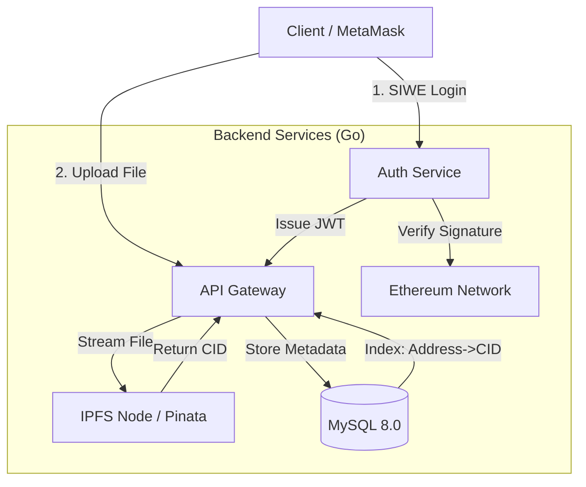

---

# Web3Drive: Decentralized Web3 Cloud Storage

**Web3Drive** 是一个融合了 Web2 高性能并发与 Web3 去中心化存储特性的云存储后端服务。它实现了一套完整的“链下计算、链上身份、分布式存储”的混合架构方案。

本项目旨在解决传统中心化网盘的数据所有权问题，同时规避纯链上存储的高昂成本与低吞吐量瓶颈。

---

## 🏗 System Architecture (架构设计)

本项目采用了 **Hybrid Storage Strategy (混合存储策略)**，这是在当前区块链基础设施成本下的最优工程解。



### 💡 Architectural Trade-offs (架构权衡)

在设计存储层时，我们面临以下选择与权衡：

1. **Full On-Chain (完全上链)**: 将文件二进制数据写入以太坊 Calldata。
* *缺陷*: 成本极高（当前 Gas 价格下，存储 1KB 数据可能花费数美元），且不仅阻塞网络，扩容性（Scalability）也极差。


2. **Centralized S3 (传统云存储)**: 使用 AWS S3 或 OSS。
* *缺陷*: 违背了 Web3 的抗审查（Censorship Resistance）和数据主权原则，中心化服务商可随时删除用户数据。


3. **Hybrid Approach (本方案)**:
* **Identity**: 使用以太坊地址作为唯一标识（DID），通过非对称加密签名验证身份。
* **Storage**: 使用 IPFS (InterPlanetary File System) 存储文件实体，确保内容寻址和去中心化。
* **Indexing**: 使用 MySQL 存储元数据（文件名、大小、CID、Owner），确保毫秒级的检索速度。


**结论**: 这种“Web2.5”架构实现了成本效率（Cost-Efficiency）与去中心化理念的平衡。

---

## 🛡 Security Design (安全性设计)

### 1. Nonce-based Replay Protection (防重放攻击)

为了防止中间人截获用户的签名并重复使用，我们实现了严格的 **Nonce 机制**：

* 用户请求登录前，必须先从服务器获取一个随机生成的 `Nonce`。
* 该 `Nonce` 绑定到用户地址，且存入数据库。
* **One-time Use (一次一密)**: 一旦签名验证完成（无论成功失败），该 Nonce 立即销毁。下一次登录必须请求新的 Challenge。

### 2. Stateless Authentication (无状态鉴权)

* 遵循 **SIWE (Sign-In with Ethereum)** 流程标准（参考 EIP-4361）。
* 后端不存储 Session，而是颁发 **JWT (JSON Web Token)**。
* JWT 包含用户钱包地址，由服务器私钥签名，确保水平扩展性（Horizontal Scalability）。

---

## 🚀 Getting Started

### Prerequisites

* Golang 1.18+
* Docker & Docker Compose
* [Pinata](https://www.pinata.cloud/) Account (for IPFS pinning)

### Installation

1. **Clone the repository**
```bash
git clone https://github.com/yourusername/web3-drive.git
cd web3-drive

```


2. **Setup Environment Variables**
复制配置文件模板并填写你的密钥（Pinata Key, JWT Secret 等）。
```bash
cp .env.example .env
# 编辑 .env 文件，填入你的配置

```


3. **Start Infrastructure (MySQL)**
使用 Docker 快速启动数据库。
```bash
docker-compose up -d

```


4. **Run the Server**
```bash
go mod tidy
go run main.go

```


*Server will start on port 8080.*

---

## 🧪 Testing Guidelines (全链路测试步骤)

由于本项目涉及钱包签名，建议结合 Postman 和 浏览器控制台 进行联合调试。

### Step 1: 获取挑战码 (Get Nonce)

**Request:**
`GET /auth/nonce?address=0xYourWalletAddress`

**Response:**

```json
{
  "nonce": "Login to D-Drive: 8a7b9c..."
}

```

### Step 2: 钱包签名 (Sign Message)

在浏览器控制台 (F12) 模拟 MetaMask 签名：

```javascript
// 替换为你上一步获取的 nonce
const nonce = "Login to D-Drive: 8a7b9c...";
const accounts = await ethereum.request({ method: 'eth_requestAccounts' });
const signature = await ethereum.request({
    method: 'personal_sign',
    params: [ "0x" + Array.from(nonce).map(c => c.charCodeAt(0).toString(16)).join(''), accounts[0] ]
});
console.log(signature);

```

### Step 3: 登录换取 Token (Login)

**Request:** `POST /auth/login`

```json
{
  "address": "0xYourWalletAddress",
  "signature": "0xSignatureFromStep2..."
}

```

**Response:** 获取 `token`。

### Step 4: 上传文件 (Upload to IPFS)

**Request:** `POST /api/upload`

* **Header**: `Authorization: Bearer <Your_Token>`
* **Body (form-data)**: `file=@test_image.png`

**Result**: 返回 IPFS CID，并可通过网关访问：`https://gateway.pinata.cloud/ipfs/<CID>`

---

## 🔮 Roadmap & Future Works

* [ ] **Storage Layer Evolution**: 引入 **Filecoin** 网络作为冷存储层，提供比 IPFS 更持久的数据保障。
* [ ] **Smart Contract Integration**: 开发 Solidity 支付合约。用户需支付 ETH/Stablecoin 订阅存储空间，合约触发后端扩容（Chainlink Oracle）。
* [ ] **Privacy**: 实现端到端加密（E2EE）。文件在上传前在客户端进行 AES 加密，仅用户持有解密私钥。
* [ ] **CDN Acceleration**: 针对热门资源配置 Cloudflare IPFS Gateway 加速。

---

## 📂 Project Structure

```text
.
├── config/             # Centralized configuration management (12-Factor App)
├── middleware/         # JWT Auth & Request Interceptors
├── models/             # GORM Data Models & Migrations
├── utils/              # Crypto (ECDSA) & IPFS Adapters
├── main.go             # Application Entry & Router
└── .env                # Environment Secrets

```

---

*Created by [zhongshoujin] - Backend Engineer transitioning to Web3.*