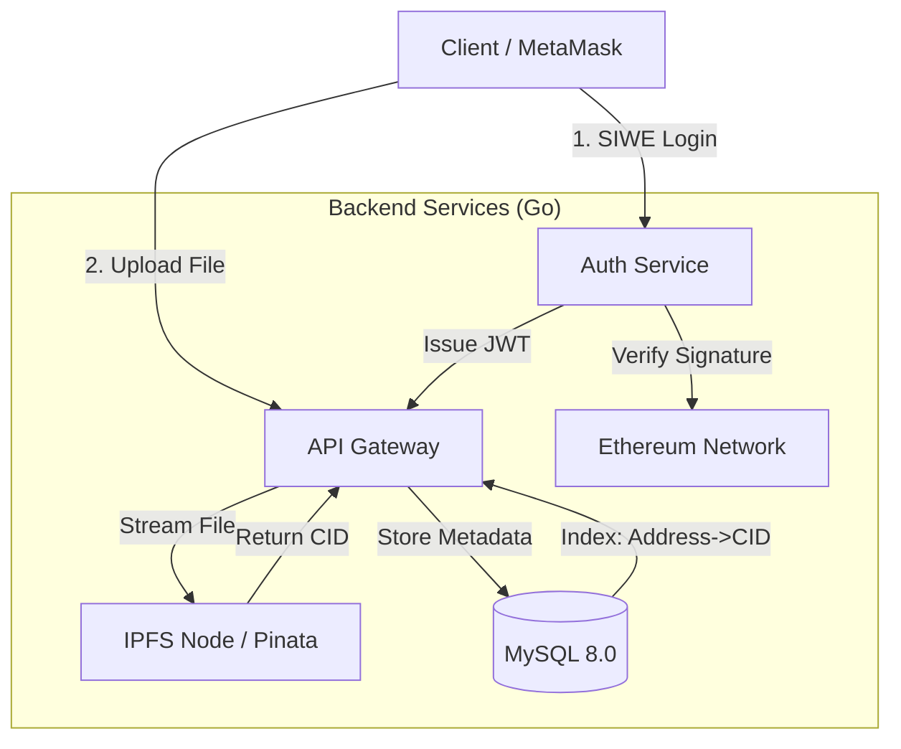

# Web3Driver: Decentralized Web3 Cloud Storage

[🇨🇳 中文文档 (Chinese Version)](./README_CN.md)

**Web3Driver** is a backend service that bridges Web2 high-performance concurrency with Web3 decentralized storage. It implements a comprehensive "Off-chain Computation, On-chain Identity, Distributed Storage" hybrid architecture.

This project aims to solve data ownership issues inherent in traditional centralized cloud storage while avoiding the prohibitive costs and low throughput of full on-chain storage.

---

## 🏗 System Architecture

We adopted a **Hybrid Storage Strategy**, which represents the optimal engineering solution given current blockchain infrastructure costs.



### 💡 Architectural Trade-offs

During the design phase, we evaluated several approaches:

1. **Full On-Chain Storage**: Writing binary data to Ethereum Calldata.
* *Verdict*: Rejected. Storing 1KB costs several dollars. It also bloats the state and lacks scalability.


2. **Centralized S3 (AWS/OSS)**:
* *Verdict*: Rejected. It violates Web3 principles of censorship resistance and data sovereignty.


3. **Hybrid Approach (Chosen)**:
* **Identity**: Ethereum Address as DID (Decentralized Identifier).
* **Storage**: **IPFS** for immutable content addressing and decentralization.
* **Indexing**: **MySQL** for metadata (Filename, Size, Owner), ensuring milliseconds latency for list operations.


**Conclusion**: This "Web2.5" architecture balances **Cost-Efficiency** with **Decentralization**.

---

## 🛡 Security Design

### 1. Nonce-based Replay Protection

To prevent replay attacks where a valid signature is intercepted and reused:

* Users must request a random `Nonce` from the server before logging in.
* The Nonce is bound to the user's address in the database.
* **One-time Use**: The Nonce is invalidated immediately after a verification attempt, regardless of the outcome.

### 2. Stateless Authentication

* Follows the **SIWE (Sign-In with Ethereum)** workflow (inspired by EIP-4361).
* The backend issues a **JWT (JSON Web Token)** signed with a secure server secret.
* This allows for **Horizontal Scalability** as no session state is required in server memory.

---

## 💾 Data Model & Schema

While we use GORM for auto-migration, the underlying schema is designed for performance and integrity. We use an **Account-Based Model**.

### Entity-Relationship Diagram

```mermaid
erDiagram
    User ||--o{ File : uploads
    User {
        string address PK "Ethereum Wallet Address (DID)"
        string nonce "Random Challenge for Auth"
    }
    File {
        uint id PK
        string cid "IPFS Content Identifier"
        string filename
        int64 size
        string owner_address FK "Indexed for query performance"
    }
    }

```

### SQL Definition

```sql
-- 1. Users Table: Identity Management
CREATE TABLE `users` (
  `address` char(42) NOT NULL COMMENT 'Ethereum Address (0x...)',
  `nonce` varchar(255) DEFAULT NULL COMMENT 'One-time challenge string',
  PRIMARY KEY (`address`)
) ENGINE=InnoDB DEFAULT CHARSET=utf8mb4;

-- 2. Files Table: Metadata Indexing
-- Binary data is NOT stored here, only the reference (CID).
CREATE TABLE `files` (
  `id` bigint(20) unsigned NOT NULL AUTO_INCREMENT,
  `created_at` datetime(3) DEFAULT NULL,
  `updated_at` datetime(3) DEFAULT NULL,
  `deleted_at` datetime(3) DEFAULT NULL,
  `cid` longtext NOT NULL COMMENT 'IPFS Hash (e.g., Qm...)',
  `filename` longtext,
  `size` bigint(20) DEFAULT NULL,
  `owner_address` char(42) DEFAULT NULL,
  PRIMARY KEY (`id`),
  KEY `idx_files_owner_address` (`owner_address`), -- Index for list queries
  KEY `idx_files_deleted_at` (`deleted_at`)        -- Soft delete support
) ENGINE=InnoDB DEFAULT CHARSET=utf8mb4;

```

---

## 🚀 Getting Started

### Prerequisites

* Golang 1.18+
* Docker & Docker Compose
* [Pinata](https://www.pinata.cloud/) Account (for IPFS pinning)

### Installation

1. **Clone the repository**
```bash
git clone [https://github.com/CAPCHER0110/web3driver.git](https://github.com/CAPCHER0110/web3driver.git)
cd web3-drive

```


2. **Setup Environment Variables**
```bash
cp .env.example .env
# Edit .env and fill in your JWT_SECRET and PINATA_JWT

```


3. **Start Infrastructure**
```bash
docker-compose up -d

```


4. **Run the Server**
```bash
go mod tidy
go run main.go

```


*Server will start on port 8080.*

---

## 🧪 Testing Guidelines

Since this involves wallet signatures, we recommend "Joint Debugging" using **Postman** and **Browser Console**.

### Step 1: Get Nonce

**Request:** `GET /auth/nonce?address=0xYourWalletAddress`
**Response:**

```json
{ "nonce": "Login to D-Drive: 8a7b9c..." }

```

### Step 2: Sign Message

Open Browser Console (F12) and run:

```javascript
// Replace with nonce from Step 1
const nonce = "Login to D-Drive: 8a7b9c...";
const accounts = await ethereum.request({ method: 'eth_requestAccounts' });
const signature = await ethereum.request({
    method: 'personal_sign',
    params: [ "0x" + Array.from(nonce).map(c => c.charCodeAt(0).toString(16)).join(''), accounts[0] ]
});
console.log(signature);

```

### Step 3: Login

**Request:** `POST /auth/login`

```json
{
  "address": "0xYourWalletAddress",
  "signature": "0xSignatureFromStep2..."
}

```

**Response:** Copy the returned `token`.

### Step 4: Upload File

**Request:** `POST /api/upload`

* **Header**: `Authorization: Bearer <Your_Token>`
* **Body (form-data)**: `file=@test_image.png`

**Result**: You will get an IPFS URL. Verify it in your browser.

---

## 🔮 Roadmap

* [ ] **Storage Layer Evolution**: Introduce **Filecoin** as a cold storage layer for better persistence guarantees.
* [ ] **Smart Contract Integration**: Implement a Solidity payment contract. Users pay ETH to expand storage quota (triggered via Chainlink Oracle).
* [ ] **Privacy**: End-to-End Encryption (E2EE). Files are AES-encrypted client-side before upload.
* [ ] **CDN Acceleration**: Configure Cloudflare IPFS Gateway for hot resources.

---

## 📂 Project Structure

```text
.
├── config/             # Centralized configuration management
├── middleware/         # JWT Auth & Request Interceptors
├── models/             # GORM Data Models & Migrations
├── utils/              # Crypto (ECDSA) & IPFS Adapters
├── main.go             # Application Entry & Router
├── docker-compose.yml  # Infrastructure as Code
└── .env                # Environment Secrets

```

```

---
