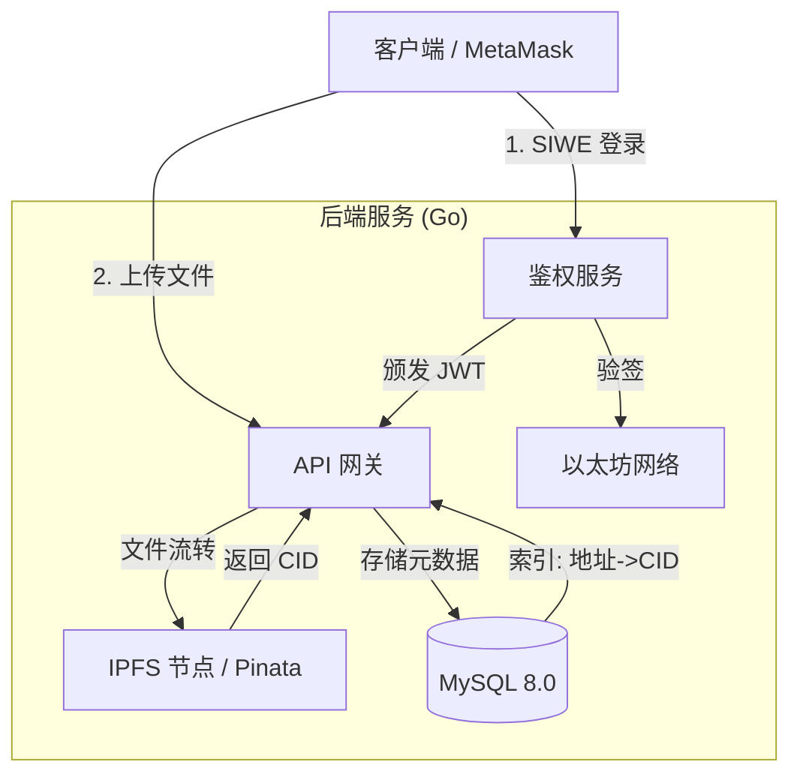
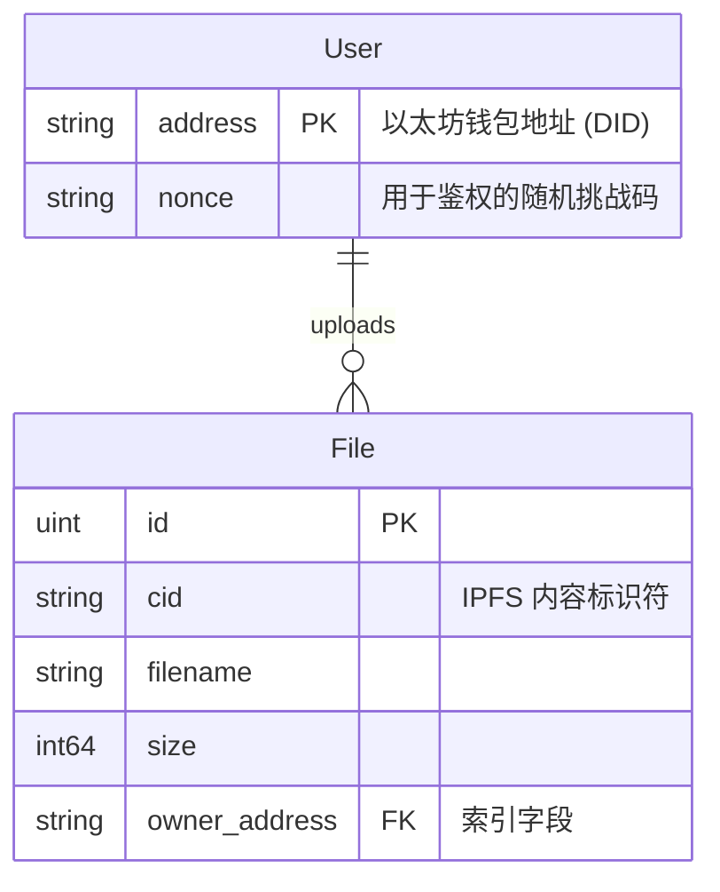

# Web3Driver: 去中心化 Web3 云存储服务

[🇺🇸 English Documentation](./README.md)

**Web3Driver** 是一个融合了 Web2 高性能并发与 Web3 去中心化存储特性的云存储后端服务。本项目实现了一套完整的“链下计算、链上身份、分布式存储”的混合架构方案。

我们致力于解决传统中心化网盘的数据所有权问题，同时规避纯链上存储带来的高昂成本与低吞吐量瓶颈。

---

## 🏗 系统架构

本项目采用了 **混合存储策略 (Hybrid Storage Strategy)**，这是在当前区块链基础设施成本下的最优工程解。



### 💡 架构权衡 (Trade-offs)

在设计存储层时，我们评估了以下方案并做出了权衡：

1. **完全上链 (Full On-Chain)**: 将文件二进制数据写入以太坊 Calldata。
* *结论*: 拒绝。当前 Gas 价格下，存储 1KB 数据可能花费数美元，且不仅阻塞网络，扩容性（Scalability）也极差。


2. **传统云存储 (S3/OSS)**:
* *结论*: 拒绝。这违背了 Web3 的抗审查（Censorship Resistance）和数据主权原则，中心化服务商可随时删除用户数据。


3. **混合架构 (本方案)**:
* **身份层**: 使用以太坊地址作为 DID (去中心化身份)。
* **存储层**: 使用 **IPFS** 存储文件实体，确保内容寻址和去中心化。
* **索引层**: 使用 **MySQL** 存储元数据（文件名、大小、归属人），确保毫秒级的检索速度。


**总结**: 这种“Web2.5”架构实现了**成本效率**与**去中心化理念**的完美平衡。

---

## 🛡 安全性设计

### 1. 基于 Nonce 的防重放机制

为了防止中间人截获用户的签名并重复使用，我们实现了严格的 **Nonce 机制**：

* 用户请求登录前，必须先从服务器获取一个随机生成的 `Nonce`。
* 该 `Nonce` 绑定到用户地址，且存入数据库。
* **一次一密 (One-time Use)**: 一旦签名验证完成（无论成功失败），该 Nonce 立即销毁。

### 2. 无状态鉴权 (Stateless Auth)

* 遵循 **SIWE (Sign-In with Ethereum)** 流程标准（参考 EIP-4361）。
* 后端不存储 Session，而是颁发 **JWT**。
* JWT 由服务器私钥签名，确保服务可进行**水平扩展 (Horizontal Scalability)**。

---

## 💾 数据模型

虽然本项目使用 GORM 进行自动迁移，但为了展示底层数据结构设计，以下是核心业务表的定义。

### 实体关系图 (ER Diagram)



### SQL 定义

```sql
-- 1. 用户表：身份管理
CREATE TABLE `users` (
  `address` char(42) NOT NULL COMMENT 'Ethereum Address (0x...)',
  `nonce` varchar(255) DEFAULT NULL COMMENT '一次性挑战码',
  PRIMARY KEY (`address`)
) ENGINE=InnoDB DEFAULT CHARSET=utf8mb4;

-- 2. 文件表：元数据索引
-- 注意：这里不存文件本体，只存 CID 引用
CREATE TABLE `files` (
  `id` bigint(20) unsigned NOT NULL AUTO_INCREMENT,
  `created_at` datetime(3) DEFAULT NULL,
  `updated_at` datetime(3) DEFAULT NULL,
  `deleted_at` datetime(3) DEFAULT NULL,
  `cid` longtext NOT NULL COMMENT 'IPFS Hash (e.g., Qm...)',
  `filename` longtext,
  `size` bigint(20) DEFAULT NULL,
  `owner_address` char(42) DEFAULT NULL,
  PRIMARY KEY (`id`),
  KEY `idx_files_owner_address` (`owner_address`), -- 列表查询索引
  KEY `idx_files_deleted_at` (`deleted_at`)        -- 支持软删除
) ENGINE=InnoDB DEFAULT CHARSET=utf8mb4;

```

---

## 🚀 快速开始

### 前置要求

* Golang 1.18+
* Docker & Docker Compose
* [Pinata](https://www.pinata.cloud/) 账号 (用于 IPFS 存储)

### 安装步骤

1. **克隆仓库**
```bash
git clone [https://github.com/CAPCHER0110/web3driver.git](https://github.com/CAPCHER0110/web3driver.git)
cd web3-drive

```


2. **配置环境变量**
```bash
cp .env.example .env
# 编辑 .env 文件，填入你的 JWT_SECRET 和 PINATA_JWT

```


3. **启动基础设施**
```bash
docker-compose up -d

```


4. **运行服务**
```bash
go mod tidy
go run main.go

```


*服务将启动在 8080 端口。*

---

## 🧪 测试指南

建议结合 **Postman** 和 **浏览器控制台** 进行联合调试。

### 第一步: 获取挑战码 (Get Nonce)

**请求:** `GET /auth/nonce?address=0x你的钱包地址`
**响应:**

```json
{ "nonce": "Login to D-Drive: 8a7b9c..." }

```

### 第二步: 钱包签名 (Sign)

在浏览器控制台 (F12) 运行：

```javascript
// 替换为第一步获取的 nonce
const nonce = "Login to D-Drive: 8a7b9c...";
const accounts = await ethereum.request({ method: 'eth_requestAccounts' });
const signature = await ethereum.request({
    method: 'personal_sign',
    params: [ "0x" + Array.from(nonce).map(c => c.charCodeAt(0).toString(16)).join(''), accounts[0] ]
});
console.log(signature);

```

### 第三步: 登录 (Login)

**请求:** `POST /auth/login`

```json
{
  "address": "0x你的钱包地址",
  "signature": "0x第二步获取的签名..."
}

```

**响应:** 复制返回的 `token`。

### 第四步: 上传文件

**请求:** `POST /api/upload`

* **Header**: `Authorization: Bearer <你的Token>`
* **Body (form-data)**: `file=@一张图片.png`

**结果**: 你将获得一个 IPFS 链接，可在浏览器中直接访问验证。

---

## 🔮 未来规划

* [ ] **存储层进化**: 引入 **Filecoin** 网络作为冷存储层，提供比 IPFS 更持久的数据保障。
* [ ] **智能合约集成**: 开发 Solidity 支付合约。用户需支付 ETH 来扩容存储空间（通过 Chainlink Oracle 触发后端）。
* [ ] **隐私保护**: 端到端加密 (E2EE)。文件在上传前在客户端进行 AES 加密。
* [ ] **CDN 加速**: 针对热门资源配置 Cloudflare IPFS Gateway 加速。

---

## 📂 项目结构

```text
.
├── config/             # 集中式配置管理
├── middleware/         # JWT 鉴权与中间件
├── models/             # GORM 数据模型
├── utils/              # 加密工具 (ECDSA) & IPFS 适配器
├── main.go             # 程序入口与路由
├── docker-compose.yml  # 基础设施编排
└── .env                # 环境密钥

```

```

```